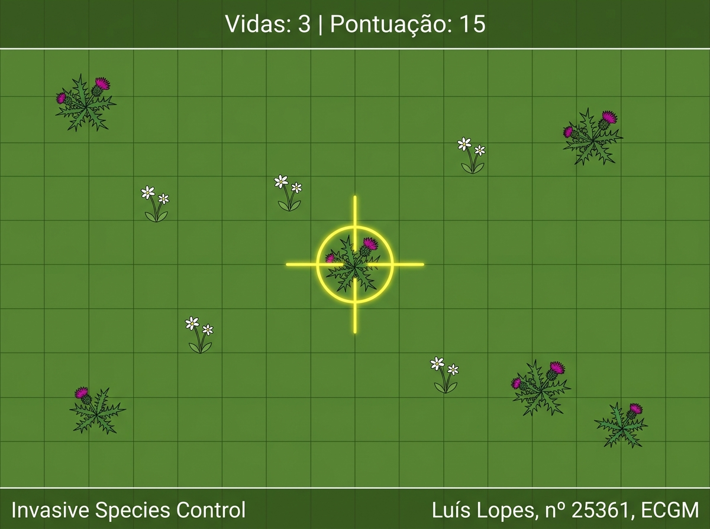

# RELATÓRIO DO EXERCÍCIO PRÁTICO - SISTEMAS MULTIMÉDIA

**Nome:** Luís Martinho Oliveira Lopes  
**Número de Aluno:** 25361  
**Sigla:** ECGM  
**Tema:** Sustentabilidade e Ambiente (Controlo de Espécies Invasoras)  
**Repositório Git:** `https://github.com/luismartinho21/SM-p.Invasoras`

---

## 1. Objetivo do Exercício

O objetivo deste exercício prático é sensibilizar para a problemática ambiental das espécies vegetais invasoras (*Chorão-das-praias* / *Carpobrotus edulis*) e a relevância de salvaguardar a flora nativa local.

O utilizador assume o papel de um **"Purificador de Solos"**, munido de um laser de energia limpa. A sua missão consiste em identificar e eliminar rapidamente as plantas invasoras que surgem aleatoriamente no terreno em vista aérea (top-down), evitando a todo o custo atingir as plantas nativas.

* **Eliminar plantas invasoras:** +10 pontos.
* **Atingir plantas nativas:** Perda de 1 vida (total de 3 vidas).
* **Combos de Purificação:** 3 invasoras consecutivas em < 5s concede um bónus de raio de destruição no próximo disparo.

---

## 2. Funcionalidades Técnicas Implementadas

1. **Máquina de Estados (3 Ecrãs):** `Início` (com pré-visualização de microfone), `Execução` (ecrã jogável) e `Resultado/Repetir` (relatório final e reinício).
2. **Controlos por Rato + Microfone:** Rato para posicionamento da mira e clique nos botões; Microfone para acionamento do laser por voz, palma, estalo de dedos ou assobio.
3. **Calibração e Histerese:** Amostragem do ruído da sala durante 3 segundos para calibrar os limites superior (`highThreshold`) e inferior (`lowThreshold`) do gatilho por histerese.
4. **Cálculo de Colisões:** Distância euclidiana `dist(mouseX, mouseY, plant.x, plant.y)`.
5. **Textos Obrigatórios do Rodapé:**
   * Canto inferior esquerdo: `"Invasive Species Control"`
   * Canto inferior direito: `"Luís Lopes, nº 25361, ECGM"`

---

## 3. Protótipo de Baixa Fidelidade (Wireframe Figma)

