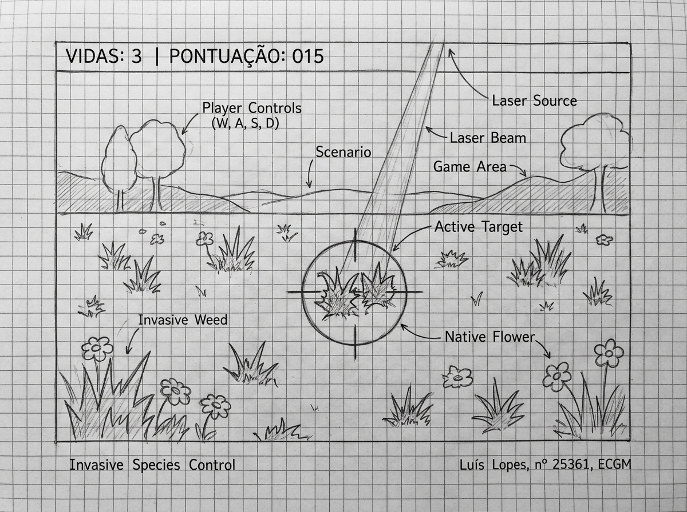

# RELATÓRIO DO EXERCÍCIO PRÁTICO - SISTEMAS MULTIMÉDIA

**Nome:** Luís Martinho Oliveira Lopes  
**Número de Aluno:** 25361  
**Sigla:** ECGM  
**Tema:** Sustentabilidade e Ambiente (Controlo de Espécies Invasoras)  
**Repositório Git:** `https://github.com/luislopes/p5-invasoras` (Código com histórico de commits progressivos)

---

## 1. Objetivo do Exercício

O objetivo deste exercício prático é sensibilizar para a problemática ambiental das espécies vegetais invasoras (ex.: *Chorão-das-praias* / *Carpobrotus edulis*) e a relevância de salvaguardar a flora nativa local. 

O utilizador assume o papel de um **"Purificador de Solos"**, munido de um laser de energia limpa. A sua missão consiste em identificar e eliminar rapidamente as plantas invasoras que surgem aleatoriamente no terreno de jogo, evitando a todo o custo atingir as plantas nativas.

O progresso é gerido por um sistema de pontuação e vidas:
* **Eliminar plantas invasoras:** Aumenta a pontuação em **+10 pontos**.
* **Atingir plantas nativas:** Resulta em **perda de 1 vida** (de um total de 3 vidas).
* **Ativação de Combos:** Recompensa a precisão e rapidez na eliminação de invasoras com disparos especiais de raio expandido.

---

## 2. Funcionalidades Técnicas Implementadas

O desenvolvimento em **p5.js** e **p5.sound** integra todas as especificações técnicas exigidas:

1. **Máquina de Estados (3 Ecrãs Distintos):**
   * **Ecrã de Início (`STATE_START` & `STATE_CALIBRATE`):** Apresenta o título, contextualização ecológica, instruções de controlo e o procedimento interativo de calibração do microfone.
   * **Ecrã de Execução (`STATE_PLAY`):** Ambiente de jogo dinâmico onde as plantas nascem no solo, com controlo contínuo de colisão, sistema de vidas, pontuação, barra de sensibilidade de áudio e indicação de combo.
   * **Ecrã de Resultado/Repetir (`STATE_GAMEOVER`):** Apresenta o relatório final com pontuação acumulada, invasoras purificadas, danos em nativas, combos ativados e permite reiniciar o exercício instantaneamente.

2. **Controlos Multimédia (Rato + Microfone):**
   * **Mira do Laser:** Controlada diretamente pelas coordenadas do cursor do rato `(mouseX, mouseY)`.
   * **Ativação do Laser:** Efetuada exclusivamente pela captação de áudio do microfone (palmas ou emissão de som curto audível), com suporte secundário à tecla `[ESPAÇO]` / clique para testes.

3. **Calibração e Histerese de Áudio:**
   * **Calibração de Ruído de Fundo:** Durante 3 segundos no ecrã inicial, a aplicação amostra o nível sonoro da sala (`mic.getLevel()`) para estabelecer a linha de base de ruído ambiente (`ambientLevel`).
   * **Controlo por Histerese:** Define um limite superior (`highThreshold`) para acionar o disparo do laser e um limite inferior (`lowThreshold`) para desarmar o gatilho. Desta forma, previne-se o disparo acidental por flutuações e impede-se disparos múltiplos contínuos durante o mesmo pulso sonoro.

4. **Cálculo de Colisões:**
   * No instante do disparo do laser, o código calcula a distância euclidiana `dist(mouseX, mouseY, plant.x, plant.y)` entre a mira e o centro de cada planta.
   * Se a distância for menor ou igual ao raio de destruição do laser acrescido do tamanho da planta, a colisão é confirmada e processada.

5. **Aleatoriedade e Interface (UI):**
   * As plantas nascem aleatoriamente no eixo X ao longo do terreno de jogo.
   * Feedback visual e sonoro imediato para cada interação (síntese sonora procedimental com Web Audio API, animação do feixe laser e explosão de partículas).
   * **Textos Obrigatórios no Rodapé:**
     * Canto inferior esquerdo: `"Invasive Species Control"`
     * Canto inferior direito: `"Luís Lopes, nº 25361, ECGM"`

6. **Funcionalidade Original — "Combos de Purificação":**
   * Se o jogador eliminar **3 plantas invasoras consecutivas em menos de 5 segundos**, é ativado automaticamente o **"Combo de Purificação"**.
   * O disparo subsequente beneficia de um **bónus de raio de destruição (de 40px para 95px)**, acompanhado de um feixe laser dourado e um efeito sonoro de celebração.

---

## 3. Protótipo de Baixa Fidelidade (Wireframe)

O esboço conceptual do ecrã de execução ilustra a disposição gráfica dos elementos da interface, terreno, espécies nativas/invasoras, mira do laser e barras informativas:

### Elementos Representados no Esboço:
* **Topo (HUD):** Indicadores de Vidas (`Vidas: 3`) e Pontuação (`Pontuação: 15`), juntamente com o medidor de áudio e histerese.
* **Terreno de Jogo:** Plantas invasoras (*Chorão-das-praias* pontiagudo) e plantas nativas (flores arredondadas) distribuídas pelo solo.
* **Mira e Laser:** Retículo centrado numa planta invasora com a simulação do feixe laser despendido do topo.
* **Rodapé:** Textos obrigatórios nos cantos inferior esquerdo (*Invasive Species Control*) e inferior direito (*Luís Lopes, nº 25361, ECGM*).
